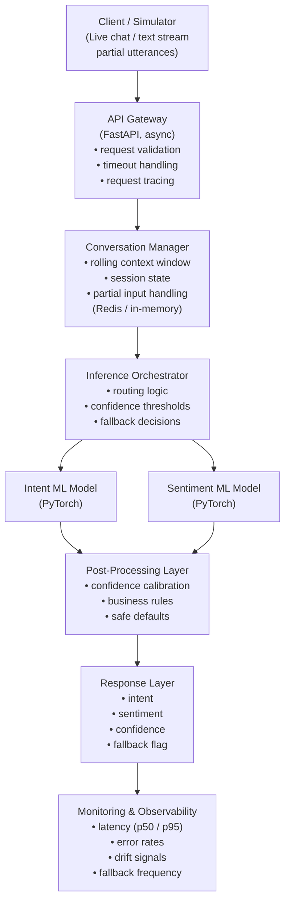

# rt-cais
Real- Time Conversation AI Inference System

## System Architecture

```mermaid
flowchart TD
    A["Client / Simulator
(Live chat / text stream
partial utterances)"]
    
    B["API Gateway
(FastAPI, async)
• request validation
• timeout handling
• request tracing"]
    
    C["Conversation Manager
• rolling context window
• session state
• partial input handling
(Redis / in-memory)"]
    
    D["Inference Orchestrator
• routing logic
• confidence thresholds
• fallback decisions"]
    
    E["Intent ML Model
(PyTorch)"]
    
    F["Sentiment ML Model
(PyTorch)"]
    
    G["Post-Processing Layer
• confidence calibration
• business rules
• safe defaults"]
    
    H["Response Layer
• intent
• sentiment
• confidence
• fallback flag"]
    
    I["Monitoring & Observability
• latency (p50 / p95)
• error rates
• drift signals
• fallback frequency"]

    A --> B
    B --> C
    C --> D
    D --> E
    D --> F
    E --> G
    F --> G
    G --> H
    H --> I

```