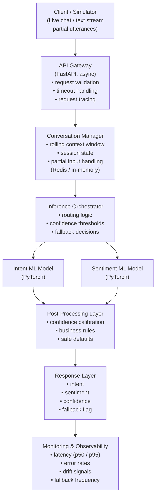

# rt-cais
Real- Time Conversation AI Inference System

## System Architecture

## Overview
This system is designed as a real time conversational AI inference service optimized for low latency, high availability environments. It processes partial conversational inputs and produces early intent and sentiment predictions while maintaining predictable performance, safe degradation, and full operational observability.

The architecture explicitly separates system orchestration, state management, and model inference, ensuring that model behaviour can be governed, monitored, and evolved independently of model weights.

The system prioritizes:
- Deterministic latency
- Controlled failure behaviour
- Production ownership over experimental flexibility

## High Level Flow

- A client (or simulator) sends partial conversational utterances in real time.
- The API Gateway validates and routes requests while enforcing latency and timeout constraints.
- The Conversation Manager maintains a bounded rolling context window per session.
- The Inference Orchestrator determines which models to invoke, whether confidence thresholds are met, and whether fallback behaviour should be triggered.
- Intent and sentiment models perform stateless inference.
- A post-processing layer applies calibration, business rules, and safety defaults.
- Structured responses are returned with confidence and fallback indicators.
- All stages emit metrics for monitoring, drift detection, and operational intervention.

## Component Breakdown
### Client / Conversation Simulator
The client simulates live conversational behaviour by sending incremental, partial text inputs rather than complete sentences. This reflects real-world conversational systems where decisions must often be made before full user intent is expressed.

This design enables early inference and allows the system to evaluate trade offs between prediction confidence and response latency.

### API Gateway (FastAPI, Async)
The API Gateway serves as the system boundary and is responsible for:
- request validation and schema enforcement,
- timeout handling and cancellation,
- request tracing via unique request identifiers.

By isolating network and protocol concerns from inference logic, the gateway ensures that latency budgets and failure behaviour are enforced consistently across all requests.

### Conversation Manager (State Layer)
The Conversation Manager maintains session-level conversational state, including:
- a rolling window of the last N utterances,
- partial input aggregation,
- bounded memory usage per session.

State is intentionally constrained to prevent unbounded memory growth and latency degradation. The window size represents a deliberate trade-off between contextual richness and real time performance.

### Inference Orchestrator
The Inference Orchestrator is the central control layer of the system.
It is responsible for:
- routing requests to appropriate models,
- enforcing confidence thresholds,
- selecting fallback strategies,
- handling slow or failed inference calls.

This layer ensures that models do not directly control system behaviour. Instead, system-level logic governs how and when model outputs are trusted, deferred, or overridden.

Separating orchestration from model code allows behavioural policies to evolve independently of model retraining.

### Model Inference Layer
The system uses independent, stateless models for:
- intent classification,
- sentiment analysis.

Models are loaded once at service startup and optimized for predictable inference latency. Separation of models allows independent optimisation, rollback, and versioning, and avoids coupling unrelated performance characteristics.